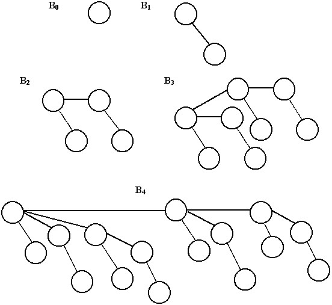
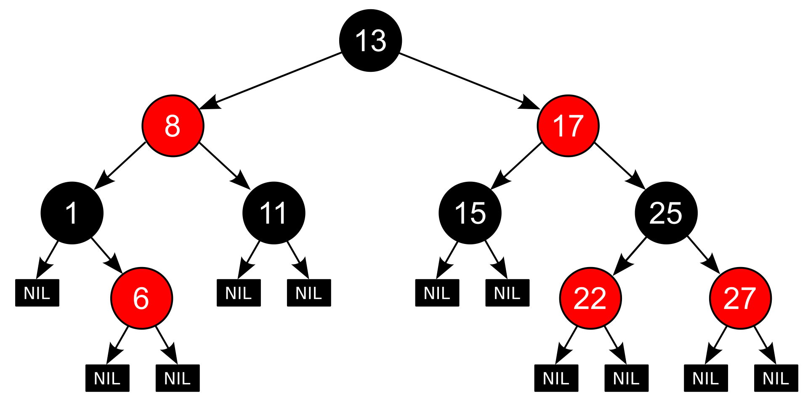

### Разница между массивом и связным списком 

Разница между массивом и связным списком заключается в том, что массив представляет собой статическую структуру 
данных, а связный список является динамической структурой данных. 

Массив и связный список - это две основные структуры данных, используемые для хранения и управления набором объектов.
Они имеют следующие отличия: 

Память: Массив в основном занимает непрерывный блок памяти, где каждый элемент имеет свой индекс. Связный список 
использует "узлы", каждый из которых содержит указатель на следующий элемент списка и данные этого элемента. Это 
означает, что элементы списка могут располагаться в любой части памяти, а они связаны только указателями.  

Размер: Размер массива фиксирован, и его нельзя изменить после выделения памяти. В связном списке размер может быть 
изменен в любое время, добавлением или удалением элементов из списка. 

Вставка и удаление: В массиве процесс вставки или удаления элемента может быть затруднен, если это приведет к 
перераспределению памяти. В связном списке элементы могут быть вставлены или удалены просто путем изменения 
указателей.  

Удаление памяти: В массиве освобождение памяти может быть выполнено только после удаления всего массива. В связном 
списке память может быть удалена по мере удаления элементов, которые указывают на нее. 

Поиск элементов: В массиве поиск элемента является быстрее, так как элементы находятся в непрерывном блоке. В 
связном списке поиск может быть затруднен, так как элементы распределены в разных участках памяти, и требуется 
последовательная перестановка, начиная с начала списка.  

Таким образом, в зависимости от задачи, которую необходимо решить, выбирают подходящую структуру данных, либо массив,
либо связный список. 


### Применение различных структур данных python в различных алгоритмах

Структура данных – это способ организации и хранения данных в программе. Они являются важной частью 
программирования и позволяют создавать более эффективные алгоритмы и улучшать быстродействие программы.  
        Рассмотрим несколько примеров применения различных структур данных в алгоритмах:

Структуры данных в Python - это способы организации и хранения данных в программе. В Python доступны следующие 
структуры данных: 

Списки (Lists) - это упорядоченный набор элементов. Списки можно изменять и использовать для хранения любых типов данных.

Кортежи (Tuples) - это упорядоченный набор элементов, но в отличие от списков они не могут быть изменены после создания.

Множества (Sets) - это коллекция уникальных элементов. Элементы множества должны быть хешируемыми.

Словари (Dictionaries) - это набор пар ключ-значение. Ключи должны быть уникальными и хешируемыми.

В Python также доступны специализированные структуры данных, такие как очереди, стеки и древовидные структуры. Чтобы 
использовать эти структуры данных, вы можете использовать библиотеки, такие как collections или heapq. 


#### Списки: 
Списки являются одной из самых используемых структур данных в Python. Они представляют собой упорядоченный 
набор элементов, которые могут быть изменены. Списки могут использоваться для хранения различных типов данных, 
включая числа, строки и другие списки. Например, в алгоритмах поиска и сортировки списки используются для хранения 
значений и их последующей обработки.

Список (List) - это структура данных, которая позволяет хранить последовательность элементов. Основное применение 
списков - организация и хранение информации, упорядочивание и изменение элементов.
Пример использования списка в алгоритме: сортировка пузырьком. В данном случае, мы можем использовать список для 
хранения неупорядоченного набора элементов, а затем, поочередно сравнивать каждый элемент с последующим и менять их 
местами, если это необходимо.

Python использует динамическое управление памятью, что означает, что память присваивается и освобождается 
автоматически во время выполнения программы. 

В Python списки могут быть изменяемыми объектами, и поэтому память, выделенная под список, может увеличиваться и 
уменьшаться в зависимости от того, как его изменяют. 

Когда вы создаете список, Python выделяет память под каждый элемент списка. Если вам нужно создать большой список, 
вы можете снизить использование памяти, используя генераторы списков вместо циклов. 

Кроме того, если вы хотите избежать необходимости создания копии списка, вы можете использовать срезы ([start:end]), 
чтобы получить подмножество списка. 

Некоторые полезные советы для уменьшения использования памяти при работе со списками в Python:

- Используйте генераторы списков вместо циклов, чтобы создавать списки
- Используйте срезы ([start:end]) вместо копирования списков
- Если вы работаете с большими объемами данных, можете использовать сторонние библиотеки, такие как NumPy или Pandas, 
которые оптимизированы для работы с массивами данных. 
- Если вы должны добавить много элементов в список, используйте метод extend вместо append. Метод append может 
привести к созданию большого количества временных списков, что потребует дополнительного использования памяти. 

Независимо от того, как вы используете списки, помните, что Python автоматически управляет памятью, поэтому вы 
можете не беспокоиться о том, что язык повредит системе из-за использования большого количества памяти. Однако 
оптимизация использования памяти может помочь повысить производительность вашей программы, особенно если вы 
работаете с большими объемами данных.   

Пример алгоритма python с использованием списка:
```python
def find_min_element(nums):
    """
    Функция находит наименьший элемент в списке nums и возвращает его
    """
    min_element = nums[0]  # присваиваем первый элемент в списке минимальному элементу
    for num in nums:  # для каждого числа в списке
        if num < min_element:  # если число меньше минимального элемента
            min_element = num  # присваиваем минимальному элементу число
    return min_element  # возвращаем найденный минимальный элемент

my_list = [5, 8, 3, 2, 9, 1]
print(find_min_element(my_list))  # вывод: 1
```
   
#### Словари: 
Словари – это структура данных, которая представляет собой неупорядоченный набор пар «ключ-значение». Они 
используются для быстрого доступа к данным с помощью ключа. В алгоритмах, связанных с обработкой больших объемов 
данных, словари могут быть использованы для хранения и обработки данных.  

Каждый раз, когда вы добавляете новый элемент в словарь, вы резервируете часть памяти для хранения этого элемента. 
Также вы можете использовать memory_profiler для измерения использования памяти при работе с вашим словарем. 

Ниже приведены некоторые рекомендации, которые могут помочь вам сэкономить память при работе со словарем.

- Используйте defaultdict, когда это уместно. defaultdict - это подкласс словаря Python, который позволяет задавать 
значение по умолчанию для ключей, которые еще не существуют в словаре. Если вы используете обычный словарь Python и 
пытаетесь получить значение для ключа, которого нет в словаре, вы получите KeyError.  
- Если ваш словарь использует целочисленные ключи, и номера ключей имеют последовательный порядок, вы можете 
использовать список вместо словаря. 
- Если ваш словарь содержит множество ключей, которые являются строками, вы можете использовать OrderedDict.
- Если вы работаете с большими объемами данных, вы можете использовать модуль shelve для более эффективного хранения 
словарей на жестком диске. 

Пример алгоритма python с использованием словаря:
```python
# Создаем словарь с некоторыми значениями
my_dict = {'apple': 10, 'orange': 15, 'banana': 20}

# Выводим все ключи из словаря
print("Все ключи в словаре:")
for key in my_dict:
    print(key)

# Выводим все значения из словаря
print("Все значения в словаре:")
for value in my_dict.values():
    print(value)

# Выводим все пары ключ-значение из словаря
print("Все пары ключ-значение в словаре:")
for key, value in my_dict.items():
    print(key, "->", value)

# Удаляем элемент из словаря
del my_dict['banana']
print("Словарь после удаления элемента:")
print(my_dict)

# Добавляем новый элемент в словарь
my_dict['pear'] = 25
print("Словарь после добавления нового элемента:")
print(my_dict) 

# Все ключи в словаре:
# apple
# orange
# banana
# Все значения в словаре:
# 10
# 15
# 20
# Все пары ключ-значение в словаре:
# apple -> 10
# orange -> 15
# banana -> 20
# Словарь после удаления элемента:
# {'apple': 10, 'orange': 15}
# Словарь после добавления нового элемента:
# {'apple': 10, 'orange': 15, 'pear': 25}
```

#### Кортежи: 
Кортежи – это неизменяемые упорядоченные наборы элементов. Кортежи используются для хранения данных, 
которые не должны изменяться в процессе выполнения программы. В алгоритмах, которые имеют дело с множеством данных, 
кортежи могут использоваться как структура для хранения пар значений.  

Кортежи (tuples) в Python хранятся в памяти как неизменяемые объекты. Это означает, что когда вы создаете кортеж, вы 
не можете изменить его содержимое в будущем. 

Кортежи занимают меньше памяти, чем списки, потому что не имеют дополнительных методов для изменения их содержимого. 
Кроме того, кортежи используют только одну ссылку на объект, поэтому они занимают меньше места в памяти. 

Например, если создать список и кортеж с одинаковыми элементами, для кортежа потребуется меньше памяти:

```python
import sys

my_list = [1, 2, 3, 'a', 'b', 'c']
my_tuple = (1, 2, 3, 'a', 'b', 'c')

print(sys.getsizeof(my_list))   # Вывод: 88
print(sys.getsizeof(my_tuple))  # Вывод: 64
```

Как видите, размер кортежа почти на треть меньше, чем размер списка. Это связано с тем, что список имеет 
дополнительные методы (append, extend, insert, remove), которые могут изменить его размер, в то время как кортеж не 
может быть изменен.  

Пример алгоритма python с использованием кортежа:
```python
'''
Этот алгоритм определяет кортеж из нескольких элементов, выводит все элементы кортежа, создает новый кортеж 
с помощью конкатенации, получает элементы кортежа по индексу, считает количество элементов в кортеже и удаляет кортеж. 
'''
# Определяем кортеж из нескольких элементов
tup1 = ('apple', 'banana', 'cherry', 'orange', 'peach')

# Выводим все элементы кортежа
for item in tup1:
    print(item)

# Определяем новый кортеж посредством конкатенации
tup2 = tup1 + ('grape', 'kiwi')

# Выводим новый кортеж
print(tup2)

# Получаем элементы кортежа по индексу
print(tup1[0])
print(tup1[2])

# Считаем количество элементов в кортеже
print(len(tup1))

# Удаляем кортеж
del tup2
```

#### Множества: 
Множества – это структуры данных, которые представляют собой неупорядоченные наборы элементов без 
повторений. Множества часто используются в алгоритмах проверки уникальности элементов или для нахождения пересечения 
и объединения множеств.  

В Python множества (set) имеют переменный размер, что означает, что они будут использовать сколько-то памяти в 
зависимости от количества элементов в них. 

Операция создания множества в Python выделяет некоторую память для хранения элементов множества. Эта память не 
освобождается до тех пор, пока множество не будет удалено (удаление происходит при помощи оператора del или после 
того, как переменная-ссылка на множество перестанет указывать на него).  

В общем случае, использование множества в Python не является особенно затратным по памяти. Если множество содержит 
несколько тысяч элементов или меньше, его размер не должен стать проблемой даже на устройствах с ограниченными 
ресурсами.  

Однако, если у вас есть большое количество элементов, то использование множества может привести к большому 
потреблению памяти. В этом случае может помочь использование специализированных структур данных, таких как битовые 
массивы (bit arrays), которые могут использоваться, если вы работаете с множеством значений из определенного 
диапазона, или Bloom filters – наборы хэш-функций, которые могут отвечать на вопрос о том, присутствует ли элемент в 
множестве или нет.    

В любом случае, если вы обнаруживаете, что использование множества приводит к проблемам с памятью, наилучшей 
стратегией может быть оптимизация алгоритма, который вы используете, или переход на более масштабируемые решения, 
использующие например базы данных или хранилища key-value.  


Пример алгоритма python с использованием множества:
```python
'''В этом примере создаются два множества, set1 и set2. Оператор & используется для нахождения пересечения множеств,
 то есть для поиска элементов, которые содержатся в обоих множествах. Результат пересечения сохраняется в 
 переменной intersection, а затем выводится на экран с помощью функции print().
''' 

# Создание множеств
set1 = set([1, 2, 3, 4])
set2 = set([3, 4, 5, 6])

# Использование оператора пересечения
intersection = set1 & set2

# Вывод результата на экран
print("Пересечение множеств:", intersection)
```

#### Очереди и стеки: 
Очереди и стеки – это структуры данных, которые используются для организации последовательности 
элементов. Очереди используются для добавления элементов в хвост очереди и извлечения элементов из головы очереди, а 
стеки используются для добавления и извлечения элементов только с одного конца. Очереди и стеки часто используются в 
алгоритмах поиска и обхода графов, например в алгоритме поиска в глубину. 

Стек (Stack) - это структура данных, которая позволяет хранить элементы в порядке "последний вошел - первый вышел". 
Стеки используются в алгоритмах, где необходимо сохранить последовательность выполнения операций и выполнить их в 
обратном порядке.
Пример использования стека в алгоритме: обход дерева в глубину. В данном случае, мы используем стек, чтобы 
сохранить последовательность посещения узлов дерева и выполнить их в обратном порядке. Такой подход позволяет 
обойти все узлы дерева и выполнить необходимые операции.

Очередь (Queue) - это структура данных, которая позволяет хранить элементы в порядке "первый вошел - первый вышел". 
Очереди используются в алгоритмах, где необходимо сохранить последовательность выполнения операций и выполнить их в 
порядке очереди.
Пример использования очереди в алгоритме: алгоритм обхода в ширину в графе. В данном случае, мы используем очередь, 
чтобы сохранить последовательность посещения вершин графа и выполнить их в порядке очереди. Это позволяет обойти все 
вершины графа и выполнить необходимые операции.  

Массив (Array) - это структура данных, которая позволяет хранить несколько элементов одного типа. Массивы 
используются для организации информации, а также для улучшения быстродействия при доступе к элементам.
Пример использования массива в алгоритме: двоичный поиск. Двоичный поиск - это алгоритм поиска элемента в 
упорядоченном массиве. Он работает быстрее, чем последовательный поиск, потому что использует принцип деления 
массива на половинки и сравнения элемента с значением середины. Таким образом, массив позволяет быстро осуществить 
доступ к элементам и выполнить необходимые операции.

### Плюсы и минусы использования базовых структур данных Python
Плюсы использования базовых структур данных Python:
- Удобство использования - базовые структуры данных в Python легко создаются и манипулируются. Например, чтобы создать 
список, достаточно указать элементы в квадратных скобках. 
- Высокая производительность - базовые структуры данных в Python имеют высокую скорость работы, что позволяет быстро 
обрабатывать большие объемы данных. 
- Разнообразие структур данных - Python поддерживает множество базовых структур данных, включая списки, кортежи, 
словари и множества, что позволяет выбрать наиболее подходящую структуру данных для конкретной задачи. 
- Широкое использование - базовые структуры данных Python используются в различных областях, от научных исследований 
до веб-разработки. 

Минусы использования базовых структур данных Python:
- Низкая эффективность работы с большими объемами данных - при работе с очень большими объемами данных, базовые структуры данных Python могут стать медленными, и потребуется использовать специализированные библиотеки для обработки данных.
- Ограниченная функциональность - базовые структуры данных Python имеют ограниченную функциональность по сравнению со специализированными структурами данных, такими как массивы или деревья.
- Нет поддержки многопоточности - базовые структуры данных Python не могут использоваться эффективно для многопоточных приложений и требуют специализированных библиотек.
- Нарушение инкапсуляции - базовые структуры данных Python не имеют инкапсулированных методов, что может привести к 
ошибкам при работе с ними. 

#### Что такое хэш-таблицы и как реализовать хэш-таблицы в Python
Хэш-таблица - это структура данных, которая позволяет эффективно хранить и получать значения по ключу. Она 
использует хэш-функцию для преобразования ключа в индекс массива. Каждый индекс в массиве связан с некоторым 
значением. Хэш-таблица позволяет быстро находить значения по ключу, используя только одну операцию доступа к памяти.   
В Python хэш-таблица реализуется в виде словаря (dict). Внутри словаря данные хранятся в виде пар ключ-значение, где 
ключи являются уникальными хэш-значениями, а значения представляют собой соответствующие объекты. 

При добавлении нового элемента в словарь, ключ этого элемента вычисляется с помощью хэш-функции, которая преобразует 
произвольную строку или число в уникальное число фиксированной длины. Затем этот ключ используется для индексации 
соответствующего места в памяти, где хранится значение.  

Для решения коллизий, т.е. ситуаций, когда два разных ключа имеют одинаковое хэш-значение, Python использует метод 
цепочек. При этом для каждого слота в таблице выделяется связный список, в который добавляются элементы с 
одинаковыми ключами хэш-функции. Когда количество элементов в списке становится слишком большим, Python 
автоматически перестраивает таблицу, увеличивая ее размер.   

Таким образом, хэш-таблица в Python реализована как динамическая структура данных, позволяющая эффективно хранить и 
быстро находить элементы по ключу. 

```python
# В Python реализация хэш-таблицы доступна в виде словарей (dict). Для добавления элемента в словарь используется 
# следующий синтаксис: 

my_dict = {}
my_dict[key] = value


# Для получения значения по ключу нужно использовать следующий синтаксис:
my_dict[key]
```

Python также позволяет использовать пользовательские классы в качестве ключей в словарях, если эти классы реализуют 
методы __hash__() и __eq__(). 

Подробный пример реализации хэш-таблицы в Python:
  
```python
class HashTable:  # Создаём класс HashTable
    def __init__(self):  # Определяем метод __init__ - инициализация или сборка класса
        self.size = 11  # определяем размер хэш-таблицы self.size
        self.slots = [None] * self.size  # массив для ключей self.slots Для начальной инициализации используем None.
        self.data = [None] * self.size  # массив для значений self.data Для начальной инициализации используем None.

    def put(self, key, data):  # Определяем метод put. В нём передаем ключ key и значение data.
        '''Определяем хэш-значение ключа hash_value с помощью метода self.hash_function.
          '''
        hash_value = self.hash_function(key, len(self.slots))
        
        ''' Если на данном хэш-значении в массиве self.slots пусто, 
        то заполняем соответствующие места ключа и значения новыми значениями.'''
        if self.slots[hash_value] is None:
            self.slots[hash_value] = key
            self.data[hash_value] = data
        else:
            '''Если на данном хэш-значении уже есть ключ, то заменяем старое значение на новое.'''
            if self.slots[hash_value] == key:
                self.data[hash_value] = data  # replace
            else:
                '''Если на данном хэш-значении пусто и 
                это не первоначальная итерация, то находим следующее пустое место в хэш-таблице с помощью метода self.rehash,
                который возвращает новое хэш-значение на основе старого (линейное пробирование).'''
                next_slot = self.rehash(hash_value, len(self.slots))
                while self.slots[next_slot] is not None and self.slots[next_slot] != key:  
                    next_slot = self.rehash(next_slot, len(self.slots))
                
                ''' Если нашёлся свободный слот, то записываем ключ и значение на него.'''
                if self.slots[next_slot] is None:
                    self.slots[next_slot] = key
                    self.data[next_slot] = data
                else:
                    self.data[next_slot] = data  # replace

    def get(self, key):
        '''Определяем метод get. В нём передаем ключ key. Определяем начальное позицию start_slot в таблице с 
        помощью метода self.hash_function. 
           
        '''
        start_slot = self.hash_function(key, len(self.slots))

        # Создаем переменную для значения data, а также переменные для управления циклом: stop, found и position.
        data = None
        stop = False
        found = False
        position = start_slot
        while self.slots[position] is not None and not found and not stop:
            '''Стартуем цикл. Если на текущей позиции в таблице находится нужный ключ, то 
            записываем соответствующее значение в переменную data и устанавливаем флаг found в значение True.'''
            if self.slots[position] == key:
                found = True
                data = self.data[position]
            else:
                '''Если на  текущей позиции в таблице находится не нужный ключ, то переходим на следующую позицию с 
                помощью метода self.rehash.'''
                position = self.rehash(position, len(self.slots))
                if position == start_slot: 
                    '''Если дошли до начальной позиции, то выходим из цикла. Возвращаем значение data, которое либо 
                    осталось None, либо содержит нужное значение.'''
                    stop = True
        return data

    def hash_function(self, key, size):
        '''Определяем метод hash_function, который принимает ключ key и размер хэш-таблицы size. Возвращает остаток 
        от деления ключа на размер таблицы.
        '''
        return key % size

    def rehash(self, old_hash, size):
        '''Определяем метод rehash, который принимает старый хэш old_hash и размер таблицы size. Возвращает новый хэш на основе 
        текущего, увеличенного на единицу. Если новый хэш больше размера таблицы, то он сбрасывается на ноль. 
        Применяется линейное пробирование. 
        '''
        return (old_hash + 1) % size
```

Пример реализации хэш-таблицы в Python:
```python
'''
Класс HashTable имеет методы insert, search и delete, которые соответственно позволяют добавлять элементы в 
хэш-таблицу, искать их и удалять. Хэш-функция просто берет остаток от деления ключа на размер таблицы. Если в один 
слот попадает несколько элементов, они хранятся в виде кортежа (ключ, значение). Если ключ уже есть в таблице при 
добавлении, то его значение заменяется новым. При поиске элемента, хэш-таблица вычисляет для него значение 
хэш-функции и итерируется по соответствующему слоту, пока не находится элемент с нужным ключом. При удалении 
элемента происходит аналогичный поиск, и если элемент найден, он удаляется из слота.
'''
class HashTable:
    def __init__(self, size=10):
        self.size = size
        self.table = [[] for _ in range(self.size)]

    def _hash_function(self, key):
        return key % self.size

    def insert(self, key, value):
        hash_value = self._hash_function(key)
        slot = self.table[hash_value]
        for i, (k, v) in enumerate(slot):
            if k == key:
                slot[i] = (key, value)
                break
        else:
            slot.append((key, value))

    def search(self, key):
        hash_value = self._hash_function(key)
        slot = self.table[hash_value]
        for k, v in slot:
            if k == key:
                return v
        raise KeyError(key)

    def delete(self, key):
        hash_value = self._hash_function(key)
        slot = self.table[hash_value]
        for i, (k, v) in enumerate(slot):
            if k == key:
                del slot[i]
                break
        else:
            raise KeyError(key)
```

#### Приоритетные очереди и способы их реализации
Чтобы понять приоритетные очереди в Python, нам нужно сначала понять, что такое очередь.

Очередь — это структура данных, в которой элементы хранятся в порядке «первым поступил — первым обслужен» (FIFO). 
Это означает, что первый элемент, добавленный в очередь, будет первым элементом, который будет удален. Очереди могут 
быть реализованы с помощью списков или очередей в Python.  

Теперь приоритетная очередь — это разновидность очереди, в которой каждый элемент имеет связанный с ним приоритет. 
Элементы удаляются из очереди в порядке их приоритета, а не в порядке их добавления. Другими словами, элемент с 
наивысшим приоритетом удаляется первым.  

В Python мы можем реализовать приоритетную очередь, используя модуль heapq, который предоставляет функции для 
создания структур данных кучи и управления ими. Куча — это двоичная древовидная структура, в которой каждый узел 
имеет значение приоритета, а его дочерние элементы имеют значения приоритета, которые ниже или равны родительскому 
узлу.

Модуль heapq предоставляет такие функции, как heappush для добавления элемента в очередь приоритетов, heappop для 
удаления элемента с наивысшим приоритетом и heapreplace для замены элемента с наивысшим приоритетом новым элементом.  

Прежде всего, в Python существуют несколько способов реализации приоритетных очередей:

- Использование встроенного модуля heapq
- Использование классической реализации на основе двоичной кучи (binary heap)
- Использование модуля queue с аргументом PriorityQueue
Для примера кода и дальнейшего описания выберем первый способ - использование модуля heapq.
```python
'''В этом примере мы создаем список чисел, который затем преобразуем в кучу с помощью функции heapq.heapify(). Затем 
мы поочередно извлекаем элементы из кучи с помощью функции heapq.heappop(), которая всегда извлекает минимальный 
элемент.
'''
import heapq

# Создаем некоторые данные
data = [5, 3, 7, 1, 2, 8, 4]

# Преобразуем список в кучу (heap)
heapq.heapify(data)

# Извлекаем элементы из кучи
while data:
    print(heapq.heappop(data))
```

```python
import heapq

# создадим пустую кучу
heap = []

# добавить элементы в кучу со значениями приоритета
heapq.heappush(heap, (1, 'first element'))
heapq.heappush(heap, (3, 'third element'))
heapq.heappush(heap, (2, 'second element'))

# удалим элементы из кучи по приоритету
print(heapq.heappop(heap))  # (1, 'first element')
print(heapq.heappop(heap))  # (2, 'second element')
print(heapq.heappop(heap))  # (3, 'third element')
```

### Знание расширенных структур данных
#### B-дерево
B-дерево - это структура данных, которая используется для хранения и упорядочения больших объемов данных. Оно 
является сбалансированным деревом, то есть каждая ветвь содержит примерно одинаковое число элементов. Особенностью 
B-дерева является наличие нескольких ключей на узле, что позволяет улучшить эффективность поиска данных.
Б-дерево - это сбалансированное дерево поиска, которое предназначено для уменьшения количества обращений к диску при 
поиске данных на жестком диске. Оно состоит из узлов разного размера, которые хранят ключи и ссылки на другие узлы. 


Пример реализации B-дерева на языке Python:
```python
'''Это минимальная реализация классов BNode и BTree на Python. Она позволяет вставлять новые элементы в дерево и 
выводить его содержимое на экран. В данной реализации используется параметр t, который определяет минимальное 
количество ключей на узле.  
'''
class BNode:
    def __init__(self, leaf=False):
        self.leaf = leaf
        self.keys = []
        self.child = []


class BTree:
    def __init__(self, t):
        self.root = BNode(True)
        self.t = t

    def insert(self, k):
        root = self.root
        if len(root.keys) == (2 * self.t) - 1:
            new_root = BNode()
            self.root = new_root
            new_root.child.insert(0, root)
            self._split(new_root, 0)
            self._insert_non_full(new_root, k)
        else:
            self._insert_non_full(root, k)

    def _insert_non_full(self, node, k):
        i = len(node.keys) - 1
        if node.leaf:
            node.keys.append(0)
            while i >= 0 and k < node.keys[i]:
                node.keys[i+1] = node.keys[i]
                i -= 1
            node.keys[i+1] = k
        else:
            while i >= 0 and k < node.keys[i]:
                i -= 1
            if len(node.child[i+1].keys) == (2*self.t)-1:
                self._split(node, i+1)
                if k > node.keys[i+1]:
                    i += 1
            self._insert_non_full(node.child[i+1], k)

    def _split(self, node, i):
        t = self.t
        y = node.child[i]
        z = BNode(y.leaf)
        node.child.insert(i+1, z)
        node.keys.insert(i, y.keys[t-1])
        z.keys = y.keys[t:(2*t)-1]
        y.keys = y.keys[0:t-1]
        z.child = y.child[t:(2*t)]
        y.child = y.child[0:t-1]

    def print_tree(self, node=None, level=0):
        if node is None:
            node = self.root

        print('Level', level, '->', len(node.keys), end=":")
        for i in node.keys:
            print(i, end=' ')
        print()

        if not node.leaf:
            for i in node.child:
                self.print_tree(i, level + 1)
```


Вот пример реализации Б-дерева и его использования на Python:
```python
'''В этом коде мы определяем класс «BTreeNode», который представляет собой узел Б-дерева. Узел содержит список 
ключей и ссылки на другие узлы. Класс «BTree» представляет собой само дерево. Метод «insert» вставляет новый ключ в 
дерево, метод «_split_child» разделяет узел и метод «_insert_nonfull» вставляет новый ключ в неполный узел.  '''
class BTreeNode:
    def __init__(self, leaf=False):
        self.leaf = leaf
        self.keys = []
        self.child = []

class BTree:
    def __init__(self, degree):
        self.root = BTreeNode(True)
        self.degree = degree

    def insert(self, k):
        r = self.root
        if len(r.keys) == (2*self.degree)-1:
            s = BTreeNode()
            self.root = s
            s.child.insert(0, r)
            self._split_child(s, 0)
            self._insert_nonfull(s, k)
        else:
            self._insert_nonfull(r, k)

    def _insert_nonfull(self, x, k):
        i = len(x.keys)-1
        if x.leaf:
            x.keys.append(0)
            while i >= 0 and k < x.keys[i]:
                x.keys[i+1] = x.keys[i]
                i -= 1
            x.keys[i+1] = k
        else:
            while i >= 0 and k < x.keys[i]:
                i -= 1
            i += 1
            if len(x.child[i].keys) == (2*self.degree)-1:
                self._split_child(x, i)
                if k > x.keys[i]:
                    i += 1
            self._insert_nonfull(x.child[i], k)

    def _split_child(self, x, i):
        t = self.degree
        y = x.child[i]
        z = BTreeNode(leaf=y.leaf)

        x.child.insert(i+1, z)
        x.keys.insert(i, y.keys[t-1])

        z.keys = y.keys[t:(2*t)-1]
        y.keys = y.keys[0:t-1]

        if not y.leaf:
            z.child = y.child[t:(2*t)]
            y.child = y.child[0:t-1]

    def search(self, k, x=None):
        if isinstance(x, BTreeNode):
            i = 0
            while i < len(x.keys) and k > x.keys[i]:
                i += 1
            if i < len(x.keys) and k == x.keys[i]:
                return x, i
            elif x.leaf:
                return None
            else:
                return self.search(k, x.child[i])
        else:
            return self.search(k, self.root)

    def __str__(self):
        r = self.root
        return self._to_string(r)

    def _to_string(self, x, lvl=0):
        ret = " " * lvl
        if x is None:
            return ret + "None\n"
        else:
            if x.leaf:
                ret += "Leaf -> "
            else:
                ret += "Node -> "
            ret += str(x.keys) + "\n"
            for i in range(len(x.child)):
                ret += self._to_string(x.child[i], lvl + 1)
            return ret

'''В этом примере мы создаем Б-дерево с минимальной степенью 3 и вставляем несколько ключей в дерево. Затем мы 
выполняем поиск ключей в дереве с помощью метода «search». Если ключ находится в дереве, метод «search» возвращает 
узел и индекс ключа в этом узле. Если ключ не найден, метод возвращает значение None.   
'''
t = BTree(3)
t.insert(8)
t.insert(18)
t.insert(2)
t.insert(1)
t.insert(20)
t.insert(50)
t.insert(23)

print(t.search(2))
print(t.search(23))
print(t.search(300))
```

#### Биномиальная куча 
Биномиальная куча (binomial heap) - это структура данных, которая представляет собой лес биномиальных деревьев. Она 
позволяет эффективно добавлять, удалять и обновлять элементы, а также искать минимальный элемент. 

Биномиальный лес – это семейство биномиальных деревьев.

Биномиальное дерево высоты h = 0 состоит из одной единственной вершины, биномиальное дерево Bk высоты h = k 
образуется присоединением биномиального дерева высоты k-1 к корню другого биномиального дерева высоты k-1. Ниже 
показаны биномиальные деревья B0, B1, B2, B3 и B4.  



Ниже приведена простая реализация биномиальной кучи на языке Python.
```python
'''В этой реализации биномиальной кучи используется вложенный класс Node, который представляет вершину биномиального 
дерева. Куча хранится как односвязный список биномиальных деревьев в порядке убывания их размеров. Операция 
объединения двух биномиальных деревьев происходит с помощью рекурсивного объединения их корневых списков. Операция 
удаления минимального элемента происходит поиском минимального узла в списке и его последующим удалением.   
'''
class BinomialHeap:
    class Node:
        def __init__(self, key, value):
            self.key = key
            self.value = value
            self.degree = 0
            self.parent = None
            self.child = None
            self.sibling = None
    
    def __init__(self):
        self.head = None
    
    def push(self, key, value):
        new_node = self.Node(key, value)
        self.head = self._merge_lists(self.head, new_node)
    
    def pop(self):
        if not self.head:
            return None
        
        min_node = self.head
        prev_node = None
        curr_node = min_node
        
        while curr_node.sibling:
            if curr_node.sibling.key < min_node.key:
                min_node = curr_node.sibling
                prev_node = curr_node
            curr_node = curr_node.sibling
        
        if prev_node:
            prev_node.sibling = min_node.sibling
        elif min_node == self.head:
            self.head = min_node.sibling
        
        child_head = min_node.child
        if child_head:
            child_head.parent = None
            curr_node = child_head
            while curr_node:
                next_node = curr_node.sibling
                curr_node.sibling = curr_node.parent = None
                self.head = self._merge_lists(self.head, curr_node)
                curr_node = next_node
        
        return min_node.value
    
    def peek(self):
        return self.head.value if self.head else None
    
    def _merge_lists(self, head1, head2):
        if not head1:
            return head2
        if not head2:
            return head1
        
        if head1.key < head2.key:
            head1.sibling = self._merge_lists(head1.sibling, head2)
            return head1
        else:
            head2.sibling = self._merge_lists(head2.sibling, head1)
            return head2
```

#### Фибоначчиева куча 
Фибоначчиева куча (англ. Fibonacci heap) — структура данных, представляющая собой набор деревьев, упорядоченных в 
соответствии со свойством неубывающей пирамиды. Фибоначчиевы кучи были введены Майклом Фредманом и Робертом 
Тарьяном в 1984 году.

Структура является  реализацией абстрактного типа данных «Очередь с приоритетом», и замечательна тем, что операции, 
в которых не требуется удаление, имеют амортизированное время работы. Кроме стандартных операций INSERT, MIN, 
DECREASE-KEY, фибоначчиева куча позволяет за время равное время выполнять операцию UNION слияния двух куч.

```python
'''Вы можете использовать функцию fibonacci_heap() для создания новой кучи Фибоначчи. Затем вы можете выполнить 
операции вставки и удаления элементов из кучи. Например, для вставки элемента используйте метод insert(val), а для 
извлечения минимального элемента - метод extract_min().  '''
def fibonacci_heap():
    class Node:
        def __init__(self, val):
            self.val = val
            self.child = None
            self.left = None
            self.right = None
            self.marked = False
            self.degree = 0
            self.parent = None
            
        def __str__(self):
            return str(self.val)
        
    class FibonacciHeap:
        def __init__(self):
            self.min = None
            self.trees = []
            self.num_nodes = 0
            
        def insert(self, val):
            node = Node(val)
            if self.min == None:
                self.min = node
            else:
                self._add_to_root_list(node)
                if node.val < self.min.val:
                    self.min = node
            self.num_nodes += 1
        
        def _add_to_root_list(self, node):
            node.left = None
            node.right = None
            self.trees.append(node)
            
        def extract_min(self):
            z = self.min
            if z != None:
                for c in z.child:
                    self._add_to_root_list(c)
                    c.parent = None
                self.trees.remove(z)
                self.num_nodes -= 1
                if z == z.right:
                    self.min = None
                else:
                    self.min = z.right
                    self._consolidate()
            return z
        
        def _consolidate(self):
            A = [None] * self.num_nodes
            for i in range(len(self.trees)):
                x = self.trees[i]
                d = x.degree
                while A[d] != None:
                    y = A[d]
                    if x.val > y.val:
                        temp = x
                        x = y
                        y = temp
                    self._fib_heap_link(y, x)
                    A[d] = None
                    d += 1
                A[d] = x
            self.min = None
            for i in range(len(A)):
                if A[i] != None:
                    if self.min == None:
                        self.trees = []
                        self.min = A[i]
                    else:
                        self._add_to_root_list(A[i])
                        if A[i].val < self.min.val:
                            self.min = A[i]

        def _fib_heap_link(self, y, x):
            self.trees.remove(y)
            y.left = y
            y.right = y
            y.parent = x
            x.degree += 1
            if x.child == None:
                x.child = y
            else:
                self._add_to_child_list(x.child, y)
            y.marked = False
            
        def _add_to_child_list(self, parent, child):
            child.left = parent.left
            child.right = parent
            parent.left.right = child
            parent.left = child
            
    return FibonacciHeap()

'''Например, чтобы создать новую кучу Фибоначчи и вставить в нее элементы 5, 3 и 8'''
heap = fibonacci_heap()

heap.insert(5)
heap.insert(3)
heap.insert(8)

'''А затем, чтобы извлечь минимальный элемент из кучи, выполните следующую команду'''
min = heap.extract_min()
print(min)
'''Результатом этой команды будет строка "3", так как 3 является минимальным элементом в куче.'''
```

#### АВЛ-дерево
АВЛ-дерево — сбалансированное по высоте двоичное дерево поиска: для каждой его вершины высота её двух поддеревьев 
различается не более чем на 1, имеет высокую эффективность при выполнении операций поиска, 
добавления и удаления элементов.

АВЛ — аббревиатура, образованная первыми буквами создателей (советских учёных) Адельсон-Вельского Георгия 
Максимовича и Ландиса Евгения Михайловича. 


Для создания AVL-дерева в Python мы используем классы. Каждый узел дерева определяется в виде объекта с тремя 
свойствами: значение (value), левым (left) и правым (right) потомком. 

Код создания класса для AVL-дерева может выглядеть следующим образом:
```python
class Node:
    def __init__(self, value):
        self.value = value
        self.left = None
        self.right = None
        self.height = 1
    

class AVL_Tree:
    def __init__(self):
        self.root = None
    
    # Метод для вставки нового элемента в дерево
    def insert(self, value):
        self.root = self._insert(self.root, value)

    def _insert(self, node, value):
        if not node:
            return Node(value)
        elif value < node.value:
            node.left = self._insert(node.left, value)
        else:
            node.right = self._insert(node.right, value)

        node.height = 1 + max(self._height(node.left), self._height(node.right))

        balance = self._balance(node)

        if balance > 1 and value < node.left.value:
            return self._rotate_right(node)

        if balance < -1 and value > node.right.value:
            return self._rotate_left(node)

        if balance > 1 and value > node.left.value:
            node.left = self._rotate_left(node.left)
            return self._rotate_right(node)

        if balance < -1 and value < node.right.value:
            node.right = self._rotate_right(node.right)
            return self._rotate_left(node)

        return node

    # Метод для удаления элемента из дерева
    def delete(self, value):
        self.root = self._delete(self.root, value)

    def _delete(self, node, value):
        if not node:
            return node

        elif value < node.value:
            node.left = self._delete(node.left, value)

        elif value > node.value:
            node.right = self._delete(node.right, value)

        else:
            if node.left is None:
                temp = node.right
                node = None
                return temp

            elif node.right is None:
                temp = node.left
                node = None
                return temp

            temp = self._min_value_node(node.right)
            node.value = temp.value
            node.right = self._delete(node.right, temp.value)

        if node is None:
            return node

        node.height = 1 + max(self._height(node.left), self._height(node.right))

        balance = self._balance(node)

        if balance > 1 and self._balance(node.left) >= 0:
            return self._rotate_right(node)

        if balance < -1 and self._balance(node.right) <= 0:
            return self._rotate_left(node)

        if balance > 1 and self._balance(node.left) < 0:
            node.left = self._rotate_left(node.left)
            return self._rotate_right(node)

        if balance < -1 and self._balance(node.right) > 0:
            node.right = self._rotate_right(node.right)
            return self._rotate_left(node)

        return node

    # Метод для проверки сбалансированности дерева
    def _balance(self, node):
        if not node:
            return 0

        return self._height(node.left) - self._height(node.right)

    # Метод для нахождения высоты дерева
    def _height(self, node):
        if not node:
            return 0

        return node.height

    # Метод для выполнения левого поворота
    def _rotate_left(self, node):
        y = node.right
        z = y.left

        y.left = node
        node.right = z

        node.height = 1 + max(self._height(node.left), self._height(node.right))
        y.height = 1 + max(self._height(y.left), self._height(y.right))

        return y

    # Метод для выполнения правого поворота
    def _rotate_right(self, node):
        y = node.left
        z = y.right

        y.right = node
        node.left = z

        node.height = 1 + max(self._height(node.left), self._height(node.right))
        y.height = 1 + max(self._height(y.left), self._height(y.right))

        return y

    # Метод для нахождения узла с минимальным значением
    def _min_value_node(self, node):
        current = node

        while current.left is not None:
            current = current.left

        return current

```

#### Красно-чёрное дерево 
Красно-чёрное дерево (англ. red-black tree, RB tree) — один из видов самобалансирующихся двоичных деревьев поиска, 
гарантирующих логарифмический рост высоты дерева от числа узлов и позволяющее быстро выполнять основные операции 
дерева поиска: добавление, удаление и поиск узла. Сбалансированность достигается за счёт введения дополнительного 
атрибута узла дерева — «цвета». Этот атрибут может принимать одно из двух возможных значений — «чёрный» или 
«красный».    

Изобретателем красно-чёрного дерева считают немца Рудольфа Байера. Название «красно-чёрное дерево» структура данных 
получила в статье Л. Гимбаса и Р. Седжвика (1978). По словам Гимбаса, они использовали ручки двух цветов. По 
словам Седжвика, красный цвет лучше всех смотрелся на лазерном принтере.

Красно-чёрное дерево используется для организации сравнимых данных, таких как фрагменты текста или числа. Листовые 
узлы красно-чёрных деревьев не содержат данных, благодаря чему не требуют выделения памяти — достаточно записать в 
узле-предке в качестве указателя на потомка нулевой указатель. Однако в некоторых реализациях для упрощения 
алгоритма могут использоваться явные листовые узлы.   



Красно-чёрное дерево является структурой данных, представляющей собой бинарное дерево поиска, также известное как 
2-3-4 дерево или симметричное мультипликативное дерево, используемой для хранения и 
упорядочивания элементов, и который обладает следующими свойствами: 

- Каждый узел может быть красным или черным.
- Корень дерева всегда черный.
- Каждый лист дерева (NULL) также является черным.
- Если узел красный, то его дочерние узлы должны быть черными (обратное правило может быть нарушено).
- Для каждого узла все пути от него до листьев содержат одинаковое количество черных узлов.

Код на Python для красно-черного дерева:

```python
class Node(object):
    """Узел дерева"""
    def __init__(self, key, color="red"):
        self.key = key
        self.left = None
        self.right = None
        self.parent = None
        self.color = color

class RedBlackTree(object):
    """Красно-черное дерево"""
    def __init__(self):
        self.nil = Node(None, "black")
        self.nil.left = self.nil.right = self.nil.parent = self.nil
        self.root = self.nil

    def insert(self, key):
        """Добавление элемента"""
        new_node = Node(key)
        y = self.nil
        x = self.root
        # Поиск места вставки нового узла
        while x != self.nil:
            y = x
            if new_node.key < x.key:
                x = x.left
            else:
                x = x.right
        new_node.parent = y
        if y == self.nil:
            self.root = new_node
        elif new_node.key < y.key:
            y.left = new_node
        else:
            y.right = new_node
        new_node.left = new_node.right = self.nil
        new_node.color = "red"
        self.insert_fixup(new_node)

    def insert_fixup(self, z):
        """Восстановление свойств дерева"""
        while z.parent.color == "red":
            if z.parent == z.parent.parent.left:
                y = z.parent.parent.right
                if y.color == "red":
                    z.parent.color = y.color = "black"
                    z.parent.parent.color = "red"
                    z = z.parent.parent
                else:
                    if z == z.parent.right:
                        z = z.parent
                        self.left_rotate(z)
                    z.parent.color = "black"
                    z.parent.parent.color = "red"
                    self.right_rotate(z.parent.parent)
            else:
                y = z.parent.parent.left
                if y.color == "red":
                    z.parent.color = y.color = "black"
                    z.parent.parent.color = "red"
                    z = z.parent.parent
                else:
                    if z == z.parent.left:
                        z = z.parent
                        self.right_rotate(z)
                    z.parent.color = "black"
                    z.parent.parent.color = "red"
                    self.left_rotate(z.parent.parent)
        self.root.color = "black"

    def left_rotate(self, x):
        """Левый поворот"""
        y = x.right
        x.right = y.left
        if y.left != self.nil:
            y.left.parent = x
        y.parent = x.parent
        if x.parent == self.nil:
            self.root = y
        elif x == x.parent.left:
            x.parent.left = y
        else:
            x.parent.right = y
        y.left = x
        x.parent = y

    def right_rotate(self, x):
        """Правый поворот"""
        y = x.left
        x.left = y.right
        if y.right != self.nil:
            y.right.parent = x
        y.parent = x.parent
        if x.parent == self.nil:
            self.root = y
        elif x == x.parent.right:
            x.parent.right = y
        else:
            x.parent.left = y
        y.right = x
        x.parent = y

    def delete(self, key):
        """Удаление элемента"""
        z = self.search(key)
        if z != self.nil:
            y = z
            y_original_color = y.color
            if z.left == self.nil:
                x = z.right
                self.transplant(z, z.right)
            elif z.right == self.nil:
                x = z.left
                self.transplant(z, z.left)
            else:
                y = self.minimum(z.right)
                y_original_color = y.color
                x = y.right
                if y.parent == z:
                    x.parent = y
                else:
                    self.transplant(y, y.right)
                    y.right = z.right
                    y.right.parent = y
                self.transplant(z, y)
                y.left = z.left
                y.left.parent = y
                y.color = z.color
            if y_original_color == "black":
                self.delete_fixup(x)

    def delete_fixup(self, x):
        """Восстановление свойств дерева"""
        while x != self.root and x.color == "black":
            if x == x.parent.left:
                w = x.parent.right
                if w.color == "red":
                    w.color = "black"
                    x.parent.color = "red"
                    self.left_rotate(x.parent)
                    w = x.parent.right
                if w.left.color == "black" and w.right.color == "black":
                    w.color = "red"
                    x = x.parent
                else:
                    if w.right.color == "black":
                        w.left.color = "black"
                        w.color = "red"
                        self.right_rotate(w)
                        w = x.parent.right
                    w.color = x.parent.color
                    x.parent.color = "black"
                    w.right.color = "black"
                    self.left_rotate(x.parent)
                    x = self.root
            else:
                w = x.parent.left
                if w.color == "red":
                    w.color = "black"
                    x.parent.color = "red"
                    self.right_rotate(x.parent)
                    w = x.parent.left
                if w.right.color == "black" and w.left.color == "black":
                    w.color = "red"
                    x = x.parent
                else:
                    if w.left.color == "black":
                        w.right.color = "black"
                        w.color = "red"
                        self.left_rotate(w)
                        w = x.parent.left
                    w.color = x.parent.color
                    x.parent.color = "black"
                    w.left.color = "black"
                    self.right_rotate(x.parent)
                    x = self.root
        x.color = "black"

    def transplant(self, u, v):
        """Замена узла"""
        if u.parent == self.nil:
            self.root = v
        elif u == u.parent.left:
            u.parent.left = v
        else:
            u.parent.right = v
        v.parent = u.parent

    def search(self, key):
        """Поиск элемента"""
        x = self.root
        while x != self.nil and x.key != key:
            if key < x.key:
                x = x.left
            else:
                x = x.right
        return x

    def minimum(self, x=None):
        """Поиск минимального элемента"""
        if x is None:
            x = self.root
        while x.left != self.nil:
            x = x.left
        return x

    def maximum(self, x=None):
        """Поиск максимального элемента"""
        if x is None:
            x = self.root
        while x.right != self.nil:
            x = x.right
        return x

    def inorder_walk(self, node=None):
        """Обход узлов в порядке возрастания ключей"""
        if node is None:
            node = self.root
        if node != self.nil:
            for x in self.inorder_walk(node.left):
                yield x
            yield node.key
            for x in self.inorder_walk(node.right):
                yield x

    def __iter__(self):
        return self.inorder_walk()
```

#### Косое дерево
Наихудшая временная сложность таких операций, как поиск, удаление и вставка, для двоичного дерева поиска (Binary 
Search Tree) составляет O(n). Наихудший случай случай возникает, когда дерево несбалансировано. Мы можем улучшить 
наихудший результат временной сложности до O(log n) с помощью красно-черных и АВЛ-деревьев.   

Можем ли мы добиться на практике лучшего результата, чем тот, что нам дают красно-черные или АВЛ-деревья?

Подобно красно-черным и АВЛ-деревьям, Splay-дерево (или косое дерево) также является самобалансирующимся бинарным 
деревом поиска. Основная идея splay-дерева состоит в том, чтобы помещать элемент, к которому недавно осуществлялся 
доступ, в корень дерева, что делает этот элемент, доступным за время порядка O(1) при повторном доступе. Вся суть 
заключается в том, чтобы использовать концепцию локальности ссылок (в среднестатистическом приложении 80% обращений 
приходятся на 20% элементов). Представьте себе ситуацию, когда у нас есть миллионы или даже миллиарды ключей, и лишь 
к некоторым из них обращаются регулярно, что весьма вероятно для многих типичных приложениях.     

Все операции со splay-деревом выполняются в среднем за время порядка O(log n), где n - количество элементов в дереве.
Любая отдельная операция в худшем случае может занять время порядка Тэта(n). 
 
 
Операция поиска в splay-дереве представляет собой стандартный алгоритм поиска в бинарном дереве, после которого 
дерево выворачивается (искомый узел перемещается в корень — операция splay). Если поиск завершился успехом, то 
найденный узел поднимается наверх и становится новым корнем. В противном случае корнем становится последний узел, к 
которому был осуществлен доступ до достижения NULL.    

Расширяющееся (англ. splay tree) или косое дерево является двоичным деревом поиска, в котором поддерживается 
свойство сбалансированности. Это дерево принадлежит классу «саморегулирующихся деревьев», которые поддерживают 
необходимый баланс ветвления дерева, чтобы обеспечить выполнение операций поиска, добавления и удаления за 
логарифмическое время от числа хранимых элементов. Это реализуется без использования каких-либо дополнительных полей 
в узлах дерева (как, например, в Красно-чёрных деревьях или АВЛ-деревьях, где в вершинах хранится, соответственно, 
цвет вершины и глубина поддерева). Вместо этого «расширяющие операции» (splay operation), частью которых являются 
вращения, выполняются при каждом обращении к дереву.       


Расширяющееся дерево придумали Роберт Тарьян и Даниель Слейтор в 1983 году.

```python
class Node:
    def __init__(self, value):
        self.value = value
        self.left_child = None
        self.right_child = None
 
class SkewedBinaryTree:
    def __init__(self, values):
        self.root = None
        self.build_tree(values)
 
    def build_tree(self, values):
        for value in values:
            node = Node(value)
            if self.root is None:
                self.root = node
            else:
                self.insert_node(node, self.root)
    
    def insert_node(self, node, current_node):
        if node.value > current_node.value:
            if current_node.right_child is None:
                current_node.right_child = node
            else:
                self.insert_node(node, current_node.right_child)
        else:
            if current_node.left_child is None:
                current_node.left_child = node
            else:
                self.insert_node(node, current_node.left_child)
```

#### Список с пропусками
Список с пропусками (англ. Skip List) — вероятностная структура данных, основанная на нескольких параллельных 
отсортированных связных списках с эффективностью, сравнимой с двоичным деревом (порядка O(log n) среднее время для 
большинства операций). 

В основе списка с пропусками лежит расширение отсортированного связного списка дополнительными связями, добавленными 
в случайных путях с геометрическим/негативным биномиальным распределением, таким образом, чтобы поиск по списку 
мог быстро пропускать части этого списка. Вставка, поиск и удаление выполняются за логарифмическое случайное время.   

Для создания списка с пропусками в Python можно использовать формирование списка с помощью лист-понимания (list 
comprehension) и функции range(). Например, если требуется создать список с 10 элементами, где каждый второй элемент 
является пропуском, можно написать следующий код:  

```python
my_list = [i if i % 2 == 0 else None for i in range(10)]
# Используется функция range() для создания последовательности чисел от 0 до 9.
# Если число четное, то оно добавляется в список. Если нечетное, то добавляется пропуск (None).
# Результатом выполнения кода является созданный список с пропусками.

# Таким образом, результатом выполнения этого кода будет список с элементами: 
# [0, None, 2, None, 4, None, 6, None, 8, None].

```

В этом коде используется лист-понимания для создания списка. Функция range(10) возвращает последовательность 
чисел от 0 до 9. Оператор if i % 2 == 0 используется для проверки того, является ли текущий элемент четным числом 
или нет. Если элемент четный, то он добавляется в список, иначе добавляется пропуск (None).  

#### Trie, или нагруженное дерево
Trie, или нагруженное дерево  — структура данных реализующая интерфейс ассоциативного массива, то есть позволяющая 
хранить пары «ключ-значение». Сразу следует оговорится, что в большинстве случаев ключами выступают строки, однако в 
качестве ключей можно использовать любые типы данных, представимые как последовательность байт (то есть вообще любые).  


Нагруженное дерево отличается от обычных n-арных деревьев тем, что в его узлах не хранятся ключи. Вместо них в узлах 
хранятся односимвольные метки, а ключем, который соответствует некоему узлу является путь от корня дерева до этого 
узла, а точнее строка составленная из меток узлов, повстречавшихся на этом пути. В таком случае корень дерева, 
очевидно, соответствует пустому ключу.   

TRIE (также известный как префиксное дерево или бор) - это древовидная структура данных для хранения и поиска 
множества строк. Он позволяет выполнять операции поиска, вставки и удаления строк в среднем за время, 
пропорциональное длине строки. Каждый узел дерева содержит один символ строки вместе с указателем на следующий узел 
в этой строке.   

Вот пример реализации TRIE в Python:
```python
# Класс Node представляет узел дерева, каждый из которых может иметь несколько дочерних узлов. Атрибут word_end 
# определяет, является ли данный узел концом строки. 


class Node:
    def __init__(self):
        self.children = {} # словарь дочерних узлов
        self.word_end = False # флаг конца слова

# Класс Trie использует класс Node для создания TRIE. Метод insert вставляет новое слово в TRIE дерево, а методы 
# search и startsWith производят поиск соответствующих слов или префиксов в дереве. 
class Trie:
    def __init__(self):
        self.root = Node() # создаем корень дерева
    
    def insert(self, word: str) -> None:
        node = self.root
        for char in word:
            # если узел для текущего символа не существует, то создаем его
            if char not in node.children:
                node.children[char] = Node()
            node = node.children[char]
        node.word_end = True # помечаем конец слова

    def search(self, word: str) -> bool:
        node = self.root
        for char in word:
            if char not in node.children:
                return False
            node = node.children[char]
        return node.word_end # возвращаем True, если слово найдено

    def startsWith(self, prefix: str) -> bool:
        node = self.root
        for char in prefix:
            if char not in node.children:
                return False
            node = node.children[char]
        return True # возвращаем True, если существует хотя бы одно слово с таким префиксом


# Пример использования:

trie = Trie()
words = ["apple", "banana", "cat", "dog"]

# вставляем слова в дерево
for word in words:
    trie.insert(word)
    
# проверяем, существуют ли слова в дереве
print(trie.search("banana")) # True
print(trie.search("elephant")) # False

# проверяем, существуют ли слова с заданным префиксом в дереве
print(trie.startsWith("ap")) # True
print(trie.startsWith("d")) # True
print(trie.startsWith("f")) # False

```
